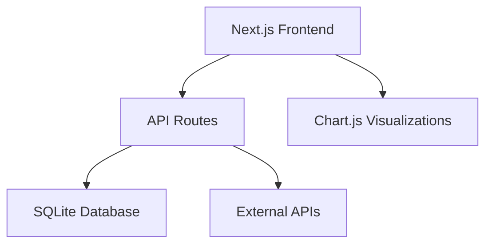

# Risk Intelligence Dashboard


A Next.js application for monitoring and analyzing DeFi protocol risk metrics in real-time.


## Features
- **Real-time Risk Metrics**: TVL volatility, liquidity concentration, treasury health
- **Whale Activity Tracking**: Large transactions monitoring
- **Volatility Analysis**: Price movement visualization
- **R-Score Metrics**: Composite risk scoring (0-1 scale)
- **Data Freshness**: Last updated indicators

## Architecture


## Setup Guide
### Prerequisites
- Node.js v18+
- Yarn

### Installation
1. Clone repository:
```bash
git clone https://github.com/yllvar/Risk-Intelligence-Dashboard.git
cd Risk-Intelligence-Dashboard
```

2. Install dependencies:
```bash
yarn install
```

3. Configure environment:
```bash
cp .env.example .env.local
```

4. Initialize database:
```bash
yarn db:init
```

5. Start development server:
```bash
yarn dev
```

## API Endpoints
| Endpoint | Description |
|----------|-------------|
| `/api/protocol-data` | Get protocol metrics |
| `/api/risk-metrics` | Get R-Score metrics |

## Components
### MetricCard.js
Displays key metrics with trend indicators

### VolatilityChart.js
Interactive price volatility chart

### WhaleActivityList.js
Real-time whale transaction feed

## Development
### Database Schema
```sql
CREATE TABLE protocol_data (
  protocol TEXT PRIMARY KEY,
  tvl REAL,
  liquidity_depth REAL,
  treasury_balance REAL,
  price_volatility REAL,
  whale_activity TEXT,
  last_updated TEXT
);

CREATE TABLE risk_metrics (
  protocol TEXT PRIMARY KEY,
  tvl_volatility REAL,
  liquidity_gini REAL,
  treasury_stablecoin_ratio REAL,
  dependence REAL,
  composite_r_score REAL,
  last_updated TEXT
);
```

### Running Tests
```bash
yarn test
```

## Deployment
1. Build production version:
```bash
yarn build
```

2. Start server:
```bash
yarn start
```

## Contributing
1. Fork the repository
2. Create feature branch
3. Submit PR

## License
MIT
